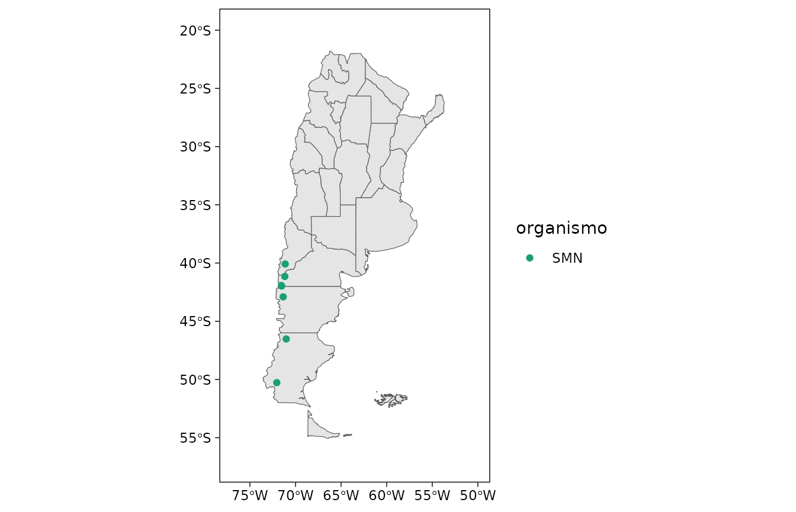
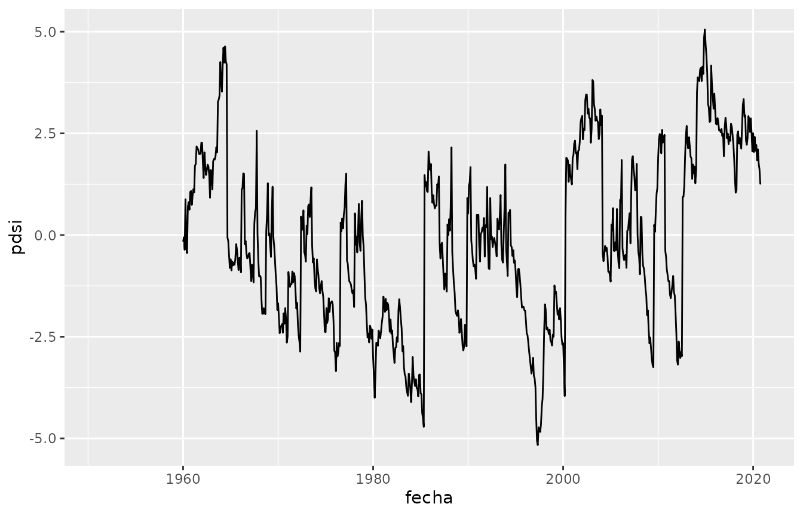
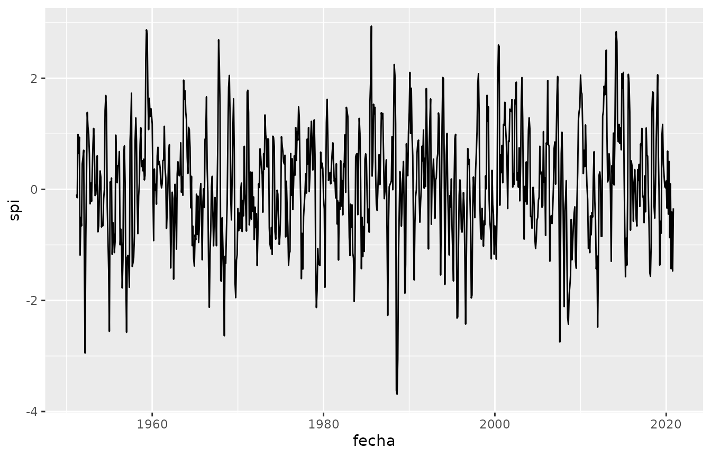
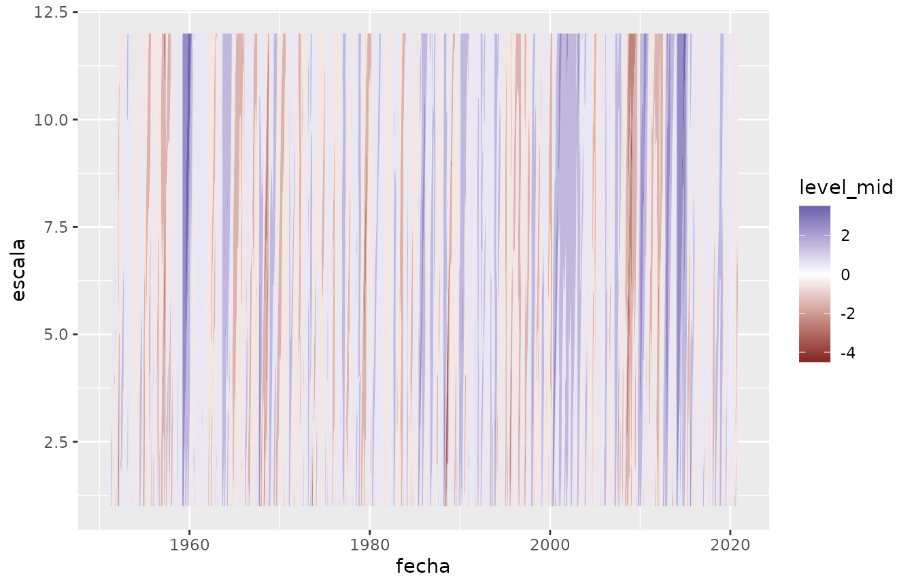
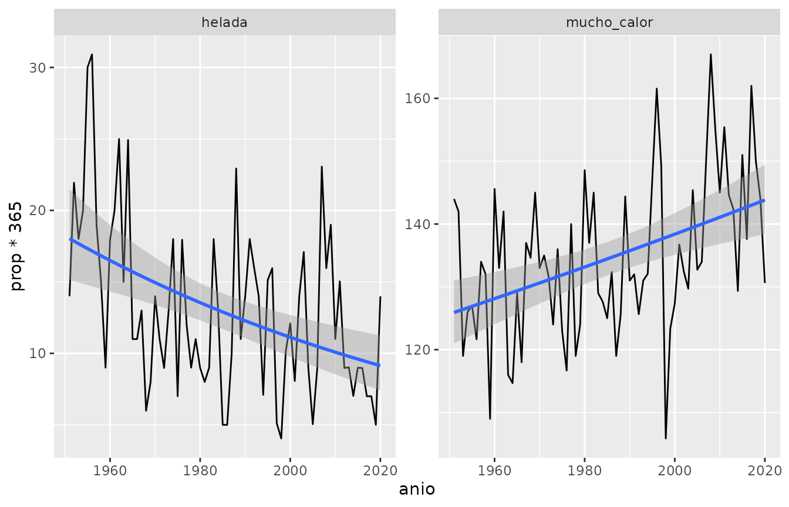
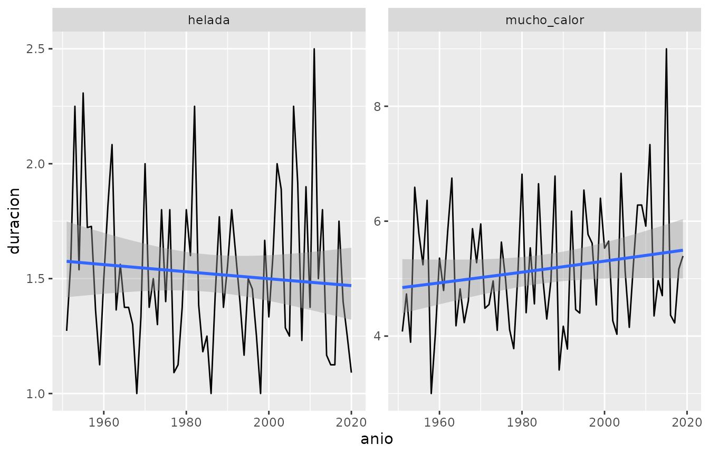
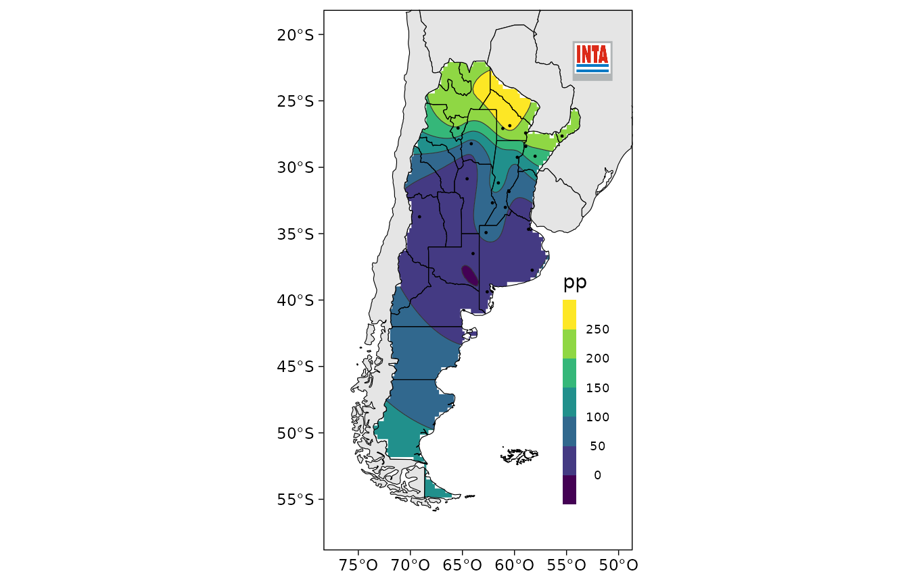
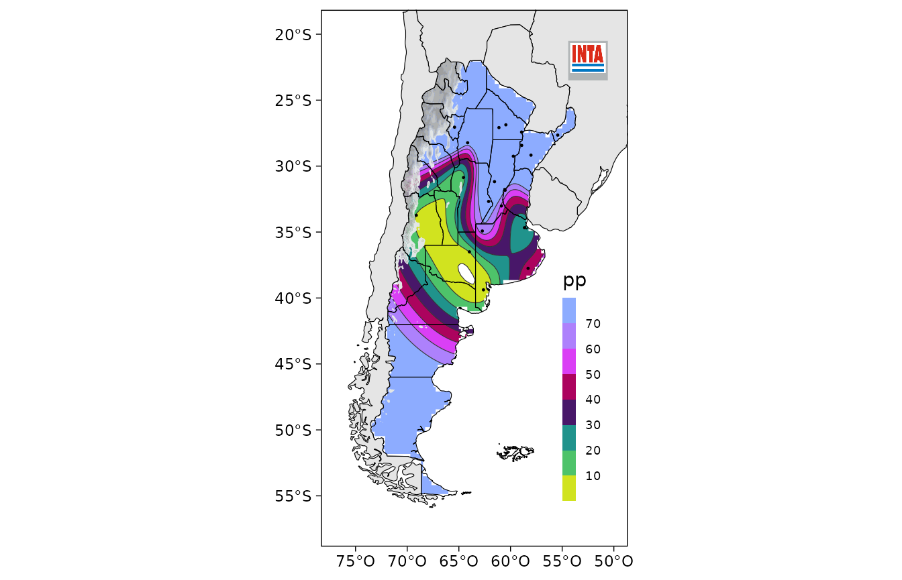
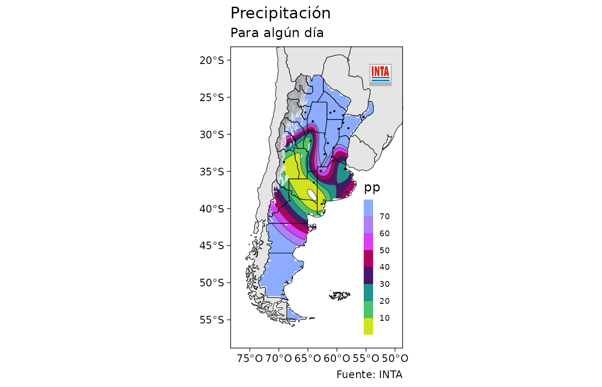

# Estadísticas e índices climáticos

``` r

library(agroclimatico)
library(magrittr)
library(dplyr)
library(ggplot2)
library(lubridate)
```

## Lectura de datos y metadatos

La función
[`leer_nh()`](https://docs.ropensci.org/agroclimatico/reference/leer_nh.md)
importa datos en el formato .DAT (columnas de ancho fijo) usado por el
INTA para distribuir los datos de las estaciones meteorológicas de su
red. A continuación se muestra un ejemplo con datos de prueba.

``` r

archivo <- system.file("extdata", "NH0358.DAT", package = "agroclimatico")
datos <- leer_nh(archivo)
head(datos)
#>   codigo codigo_nh      fecha t_max t_min precip lluvia_datos lluvia llovizna
#> 1      5      0358 1951-01-01  29.2   8.2    0.0            0     NA       NA
#> 2      5      0358 1951-01-02  31.3  17.4    0.0            0     NA       NA
#> 3      5      0358 1951-01-03  30.9  18.3    0.0            0     NA       NA
#> 4      5      0358 1951-01-04  32.9  20.1    5.2            1     NA       NA
#> 5      5      0358 1951-01-05  32.6  18.4    0.0            0     NA       NA
#> 6      5      0358 1951-01-06  30.4  10.3    0.0            0     NA       NA
#>   granizo nieve t_min_5cm t_min_50cm t_suelo_5cm t_suelo_10cm heliofania_efec
#> 1      NA    NA        NA         NA          NA           NA              NA
#> 2      NA    NA        NA         NA          NA           NA              NA
#> 3      NA    NA        NA         NA          NA           NA              NA
#> 4      NA    NA        NA         NA          NA           NA              NA
#> 5      NA    NA        NA         NA          NA           NA              NA
#> 6      NA    NA        NA         NA          NA           NA              NA
#>   heliofania_rel p_vapor hr td rocio viento_10m viento_2m rad etp
#> 1             NA      NA NA NA    NA         NA        NA  NA  NA
#> 2             NA      NA NA NA    NA         NA        NA  NA  NA
#> 3             NA      NA NA NA    NA         NA        NA  NA  NA
#> 4             NA      NA NA NA    NA         NA        NA  NA  NA
#> 5             NA      NA NA NA    NA         NA        NA  NA  NA
#> 6             NA      NA NA NA    NA         NA        NA  NA  NA
```

Los metadatos de estas estaciones se ven usando
[`metadatos_nh()`](https://docs.ropensci.org/agroclimatico/reference/metadatos_nh.md),
que devuelve un data frame con el código de cada estación, el nombre y
su localización.

``` r

head(metadatos_nh())
#>   codigo_nh     estacion    provincia organismo    lat    lon altura
#> 1      0446       Anguil     La Pampa      INTA -36.50 -63.98    165
#> 2      0196         Azul Buenos Aires       SMN -36.75 -59.83    132
#> 3      0221 Bahía Blanca Buenos Aires       SMN -38.73 -62.17     83
#> 4      0400     Balcarce Buenos Aires      INTA -37.75 -58.30    130
#> 5      0323    Bariloche    Río Negro       SMN -41.15 -71.17    840
#> 6      0216       Barrow Buenos Aires      INTA -38.32 -60.25    120
```

La función permite filtrar datos según su código, un rango de longitud,
o latitud.

``` r

head(metadatos_nh(lat = c(-40, -30)))
#>   codigo_nh      estacion    provincia organismo    lat    lon altura
#> 1      0446        Anguil     La Pampa      INTA -36.50 -63.98    165
#> 2      0196          Azul Buenos Aires       SMN -36.75 -59.83    132
#> 3      0221  Bahía Blanca Buenos Aires       SMN -38.73 -62.17     83
#> 4      0400      Balcarce Buenos Aires      INTA -37.75 -58.30    130
#> 5      0216        Barrow Buenos Aires      INTA -38.32 -60.25    120
#> 6      0008 Benito Juárez Buenos Aires       SMN -37.72 -59.78    207
```

``` r

head(metadatos_nh(lon = c(-75, -71)))
#>   codigo_nh    estacion  provincia organismo    lat    lon altura
#> 1      0323   Bariloche  Río Negro       SMN -41.15 -71.17    840
#> 2      0525    Chapelco    Neuquén       SMN -40.08 -71.13    779
#> 3      0158   El Bolsón  Río Negro       SMN -41.97 -71.52    337
#> 4      0350   El Bolsón  Río Negro       SMN -41.93 -71.55    310
#> 5      0571 El Calafate Santa Cruz       SMN -50.27 -72.05    204
#> 6      0303      Esquel     Chubut       SMN -42.90 -71.35    787
```

El data frame devuelto puede plotearse rápidamente para ver la ubicación
de las estaciones.

``` r

plot(metadatos_nh(lon = c(-75, -71)))
```



## Análisis de la precipitación

Trabajaremos con los datos de ejemplo provistos por el paquete, en este
caso de la estación meteorológica Castelar (NH0358). Para eso calculamos
los valores mensuales.

``` r

datos_mensuales <- NH0358 %>% 
  group_by(fecha = lubridate::round_date(fecha, "month")) %>% 
  reframe(precip = mean(precip, na.rm = TRUE),
          etp = mean(etp, na.rm = TRUE))

head(datos_mensuales)
#> # A tibble: 6 × 3
#>   fecha      precip   etp
#>   <date>      <dbl> <dbl>
#> 1 1951-01-01   1.48   NaN
#> 2 1951-02-01   4.39   NaN
#> 3 1951-03-01   3.53   NaN
#> 4 1951-04-01   2.00   NaN
#> 5 1951-05-01   7.47   NaN
#> 6 1951-06-01   0.44   NaN
```

### Anomalía porcentual

Una primera aproximación es calcular cuánto se desvía la precipitación
cada mes de su valor típico en porcentaje.

``` r

datos_mensuales <- datos_mensuales %>% 
  group_by(mes = month(fecha)) %>% 
  mutate(anomalia = anomalia_porcentual(precip, na.rm = TRUE))

head(datos_mensuales)
#> # A tibble: 6 × 5
#> # Groups:   mes [6]
#>   fecha      precip   etp   mes anomalia
#>   <date>      <dbl> <dbl> <dbl>    <dbl>
#> 1 1951-01-01   1.48   NaN     1  -0.522 
#> 2 1951-02-01   4.39   NaN     2   0.105 
#> 3 1951-03-01   3.53   NaN     3  -0.0169
#> 4 1951-04-01   2.00   NaN     4  -0.449 
#> 5 1951-05-01   7.47   NaN     5   1.91  
#> 6 1951-06-01   0.44   NaN     6  -0.782
```

Valores cercanos a cero implican que la precipitación de ese mes fue
similar a su valor promedio. 1 indica que llovió el doble de lo normal,
mientras que -0.5 significa que en ese mes llovió la mitad de lo que
suele llover.

Si la idea es usar esta medición para monitoreo, es importante fijar el
período de referencia sobre el cual se calcula la precipitación media (o
climatología). De otra forma, a medida que se recolectan más datos, los
promedios van a variar y con ellos los valores calculados. Entonces,
para asegurarse de que los datos futuros no modifiquen los percentiles
pasados, se puede especificar el período de referencia con el argumento
`referencia`. Por ejemplo, este código devuelve la anomalía porcentual
de cada mes con respecto a la media anterior a 1980.

``` r

datos_mensuales <- datos_mensuales %>% 
  group_by(mes = month(fecha)) %>% 
  mutate(anomalia = anomalia_porcentual(precip, na.rm = TRUE, referencia = year(fecha) < 1980)) %>% 
  ungroup()
```

`referencia` también puede ser un vector numérico de precipitación. Esto
es útil si se calcula el valor de referencia aparte y luego sólo se leen
los nuevos datos.

Otras funciones de agroclimatico tienen este argumento, así que para
mantener este período fijo, se puede crear una nueva columna.

``` r

datos_mensuales <- datos_mensuales %>% 
  mutate(referencia = year(fecha) < 1980)

head(datos_mensuales)
#> # A tibble: 6 × 6
#>   fecha      precip   etp   mes anomalia referencia
#>   <date>      <dbl> <dbl> <dbl>    <dbl> <lgl>     
#> 1 1951-01-01   1.48   NaN     1  -0.509  TRUE      
#> 2 1951-02-01   4.39   NaN     2   0.112  TRUE      
#> 3 1951-03-01   3.53   NaN     3   0.0687 TRUE      
#> 4 1951-04-01   2.00   NaN     4  -0.456  TRUE      
#> 5 1951-05-01   7.47   NaN     5   2.52   TRUE      
#> 6 1951-06-01   0.44   NaN     6  -0.798  TRUE
```

### Deciles

Otro indicador que puede analizarse es el decil al que pertenece la
precipitación de cada mes.

``` r

datos_mensuales <- datos_mensuales %>% 
  group_by(mes = month(fecha)) %>% 
  mutate(decil = decil(precip, referencia = referencia)) %>% 
  ungroup()

head(datos_mensuales)
#> # A tibble: 6 × 7
#>   fecha      precip   etp   mes anomalia referencia decil
#>   <date>      <dbl> <dbl> <dbl>    <dbl> <lgl>      <dbl>
#> 1 1951-01-01   1.48   NaN     1  -0.509  TRUE        2.41
#> 2 1951-02-01   4.39   NaN     2   0.112  TRUE        7.24
#> 3 1951-03-01   3.53   NaN     3   0.0687 TRUE        6.90
#> 4 1951-04-01   2.00   NaN     4  -0.456  TRUE        2.07
#> 5 1951-05-01   7.47   NaN     5   2.52   TRUE        9.66
#> 6 1951-06-01   0.44   NaN     6  -0.798  TRUE        1.72
```

El resultado es el valor del decil exacto al que corresponde el valor de
la precipitación teniendo en cuenta el periodo de referencia. Esto
significa que decil podria ser un valor con decimales. En este caso, si
un mes cae en el decil 5, significa que la mitad de los meses (en el
período de referencia) tiene menor precipitación.

### Índice de intensidad de sequía de Palmer

Un indicador de sequía muy utilizado es el PDSI (Palmer Drought Severity
Index) que además de la precipitación, tiene en cuenta la
evapotranspiración potencial (etp) y la capacidad de carga (cc) del
suelo. agroclimatico provee una función
[`pdsi()`](https://docs.ropensci.org/agroclimatico/reference/pdsi.md)
que computa el PSDI usando los coeficientes originales de Palmer y una
función
[`pdsi_ac()`](https://docs.ropensci.org/agroclimatico/reference/pdsi.md)
que usa la version autocalibrada.

``` r

datos_mensuales <- datos_mensuales %>%
  mutate(pdsi = pdsi_ac(precip, etp, cc = 100))

head(datos_mensuales)
#> # A tibble: 6 × 8
#>   fecha      precip   etp   mes anomalia referencia decil  pdsi
#>   <date>      <dbl> <dbl> <dbl>    <dbl> <lgl>      <dbl> <dbl>
#> 1 1951-01-01   1.48   NaN     1  -0.509  TRUE        2.41    NA
#> 2 1951-02-01   4.39   NaN     2   0.112  TRUE        7.24    NA
#> 3 1951-03-01   3.53   NaN     3   0.0687 TRUE        6.90    NA
#> 4 1951-04-01   2.00   NaN     4  -0.456  TRUE        2.07    NA
#> 5 1951-05-01   7.47   NaN     5   2.52   TRUE        9.66    NA
#> 6 1951-06-01   0.44   NaN     6  -0.798  TRUE        1.72    NA
```

``` r

ggplot(datos_mensuales, aes(fecha, pdsi)) +
  geom_line()
```



Teniendo en cuenta que este indice usa coeficientes calculados a partir
de observaciones en ubicaciones específicas en Estados Unidos, es
posible definir nuevos coeficientes con la función
[`pdsi_coeficientes()`](https://docs.ropensci.org/agroclimatico/reference/pdsi_coeficientes.md).

## Índice Estandarizado de Precipitación

A diferencia de los otros índices en el Índice Estandarizado de
Precipitación (SPI), a cada observación le puede corresponder más de un
valor (uno por cada escala temporal usada) y además devuelve una serie
completa (es decir, sin datos faltantes implícitos). Por lo tanto, en
vez de usarla con
[`mutate()`](https://dplyr.tidyverse.org/reference/mutate.html), se usa
con [`reframe()`](https://dplyr.tidyverse.org/reference/reframe.html) ya
que devuelve un data.frame.

En este caso calculamos el spi para escalas de 1 a 12 meses ya que la
variable de precipitación tiene resolución mensual.

``` r

spi <- datos_mensuales %>% 
  reframe(spi_indice(fecha, precip, escalas = 1:12, referencia = referencia))

head(spi)
#> # A tibble: 6 × 3
#>   fecha      escala    spi
#>   <date>      <dbl>  <dbl>
#> 1 1951-01-01      1 -0.919
#> 2 1951-02-01      1  0.398
#> 3 1951-03-01      1  0.340
#> 4 1951-04-01      1 -0.585
#> 5 1951-05-01      1  1.98 
#> 6 1951-06-01      1 -1.07
```

Para seguir la serie temporal en una escala en particular, primero hay
que filtrarla (o calcular el spi sólo para esa escala). Veamos que
sucede con el SPI para una escala de 3 meses.

``` r

ggplot(filter(spi, escala == 3), aes(fecha, spi)) +
  geom_line()
```



Para visualizar todas las escalas computadas, se puede usar
[`geom_contour_filled()`](https://ggplot2.tidyverse.org/reference/geom_contour.html):

``` r

ggplot(spi, aes(fecha, escala)) +
  geom_contour_filled(aes(z = spi, fill = after_stat(level_mid))) +
  scale_fill_gradient2()
```



## Análisis de extremos

Una de las principales funciones para analizar extremos es
[`umbrales()`](https://docs.ropensci.org/agroclimatico/reference/umbrales.md)
que devuelve la cantidad de observaciones que cumplen con un determinado
umbral, en general un extremo de temperatura o precipitación.

``` r

extremos <- NH0358 %>% 
  group_by(anio = year(fecha)) %>% 
  reframe(umbrales(helada = t_min <= 0,
                   mucho_calor = t_max >= 25))
head(extremos)
#> # A tibble: 6 × 5
#>    anio extremo         N   prop      na
#>   <dbl> <chr>       <int>  <dbl>   <dbl>
#> 1  1951 helada         14 0.0384 0      
#> 2  1951 mucho_calor   144 0.395  0      
#> 3  1952 helada         22 0.0601 0      
#> 4  1952 mucho_calor   142 0.389  0.00273
#> 5  1953 helada         18 0.0493 0      
#> 6  1953 mucho_calor   119 0.326  0
```

El resultado es un data frame con columnas `extremo` (el nombre del
extremo), `N` (número de observaciones para las cuales se dio el
extremo), `prop` (proporción de observaciones) y `na` (proporción de
valores faltantes),

Una posible visualización de la cantidad de días con heladas y calor
sofocante podría ser esta:

``` r

extremos %>% 
  ggplot(aes(anio, prop*365)) +
  geom_line() +
  geom_smooth(method = "glm", method.args = list(family = "quasipoisson")) +
  facet_wrap(~extremo, scales = "free")
```



Dado que esta función cuenta observaciones, es importante que las series
estén completas. Es decir, sin datos faltantes implícitos. Para
completar la serie, se puede usar la función
[`completar_serie()`](https://docs.ropensci.org/agroclimatico/reference/completar_serie.md).
Esta función toma un vector de fechas y la resolución esperada de los
datos y agrega las filas faltantes, poniendo `NA` en las columnas
asociadas a las variables observadas. Para tablas con datos para
múltiples estaciones o localidades, conviene primero agrupar.

``` r

dos_estaciones <- rbind(NH0358, NH0114)

completa <- dos_estaciones %>% 
  group_by(codigo_nh) %>% 
  completar_serie(fecha, "1 dia")
```

## Dia promedio de inicio y fin

Para las heladas, es importante saber el día promedio en el que se da la
primera y la última helada, para eso se puede usar la función
[`dias_promedio()`](https://docs.ropensci.org/agroclimatico/reference/dias_promedio.md):

``` r

NH0358 %>% 
  filter(t_min <= 0) %>%          # filtrar sólo los días donde hay heladas.
  reframe(dias_promedio(fecha))
#>     variable dia mes dia_juliano
#> 1 primer_dia  28   5         148
#> 2 ultimo_dia  31   8         243
```

La primera helada se da, en promedio, el 25 de junio y la última el 30
de agosto.

De igual manera, es posible calcular días promedio para grupos. En este
caso estaciones.

``` r

dos_estaciones %>% 
  filter(t_min <= 0) %>%
  group_by(codigo_nh) %>% 
  reframe(dias_promedio(fecha))
#> # A tibble: 4 × 5
#>   codigo_nh variable     dia   mes dia_juliano
#>   <chr>     <fct>      <int> <int>       <int>
#> 1 0114      primer_dia    30     6         181
#> 2 0114      ultimo_dia     7     8         219
#> 3 0358      primer_dia    28     5         148
#> 4 0358      ultimo_dia    31     8         243
```

### Persistencia

Un dato importante para cualquier extremo es la longitud de días
consecutivos con el extremo. La función `olas` (olas de calor, olas de
frío) divide una serie de fechas en eventos de observaciones
consecutivas donde se se da una condición lógica.

``` r

olas_de_temperatura <- NH0358 %>% 
  reframe(olas(fecha, 
               mucho_calor = t_max >= 25, 
               helada = t_min <= 0))

head(olas_de_temperatura)
#>           ola     inicio        fin duracion
#> 1 mucho_calor 1951-01-01 1951-01-21  21 days
#> 2 mucho_calor 1951-01-25 1951-01-31   7 days
#> 3 mucho_calor 1951-02-02 1951-02-03   2 days
#> 4 mucho_calor 1951-02-06 1951-02-12   7 days
#> 5 mucho_calor 1951-02-17 1951-02-23   7 days
#> 6 mucho_calor 1951-03-01 1951-03-03   3 days
```

Nuevamente, se podría visualizar el cambio en la longitud promedio de
las olas de calor y de olas de heladas de esta forma:

``` r

olas_de_temperatura %>% 
  group_by(ola, anio = year(inicio)) %>% 
  summarise(duracion = mean(duracion)) %>% 
  ggplot(aes(anio, duracion)) +
  geom_line() +
  geom_smooth(method = "glm", method.args = list(family = "quasipoisson")) +
  facet_wrap(~ola, scales = "free") 
```



## Mapas

Si se tienen observaciones en estaciones, la función
[`mapear()`](https://docs.ropensci.org/agroclimatico/reference/mapear.md)
genera un mapa de contornos llenos con el mapa de Argentina, países
limítrofes y logo del INTA.

Usamos los datos mensuales en estaciones meteorológicas provistos por el
paquete.

``` r

head(datos_nh_mensual)
#>           mes precipitacion_mensual temperatura_media_mensual codigo_nh
#>        <Date>                 <num>                     <num>    <char>
#> 1: 2019-01-01                  96.1                 22.612903      0446
#> 2: 2019-02-01                   8.2                 21.348214      0446
#> 3: 2019-03-01                  58.8                 18.064516      0446
#> 4: 2019-04-01                  10.0                 16.658333      0446
#> 5: 2019-05-01                  61.0                 12.196774      0446
#> 6: 2019-06-01                  31.4                  9.471667      0446
#>    estacion provincia organismo   lat    lon altura
#>      <char>    <char>    <char> <num>  <num>  <int>
#> 1:   Anguil  La Pampa      INTA -36.5 -63.98    165
#> 2:   Anguil  La Pampa      INTA -36.5 -63.98    165
#> 3:   Anguil  La Pampa      INTA -36.5 -63.98    165
#> 4:   Anguil  La Pampa      INTA -36.5 -63.98    165
#> 5:   Anguil  La Pampa      INTA -36.5 -63.98    165
#> 6:   Anguil  La Pampa      INTA -36.5 -63.98    165
```

``` r

abril <- datos_nh_mensual %>%
  filter(mes == unique(mes)[4]) #datos del cuarto mes en la base, abril.

mapear(abril, precipitacion_mensual, lon, lat, variable = "pp")
```



Con el argumento `escala` se puede definir la escala de colores y,
opcionalmente, los niveles en los niveles a graficar. Esto permite tener
mapas consistentes. El paquete viene con una serie de escalas ya
definidas (ver ?escalas) y la función
[`leer_surfer()`](https://docs.ropensci.org/agroclimatico/reference/leer_surfer.md)
que permite generar estas escalas a partir de los archivos .lvl que usa
el programa Surfer.

``` r

mapear(abril, precipitacion_mensual, lon, lat, 
       escala = escala_pp_diaria, 
       cordillera = TRUE,
       variable = "pp")
```



El argumento `cordillera` controla si se va a pintar de gris las
regiones de altura, donde el kriging que se usa para interpolar los
datos entre los puntos observados posiblemente sea aún menos válido que
en el resto del territorio.

Finalmente, los argumentos `titulo`, `subtitulo` y `fuente` permiten
agregar información extra.

``` r

mapear(abril, precipitacion_mensual, lon, lat, 
       escala = escala_pp_diaria, 
       cordillera = TRUE,
       titulo = "Precipitación", 
       subtitulo = "Para algún día",
       fuente = "Fuente: INTA",
       variable = "pp")
```



Como
[`mapear()`](https://docs.ropensci.org/agroclimatico/reference/mapear.md)
devuelve un objeto de ggplot2, se puede seguir customizando con
cualquier función de ese paquete.
